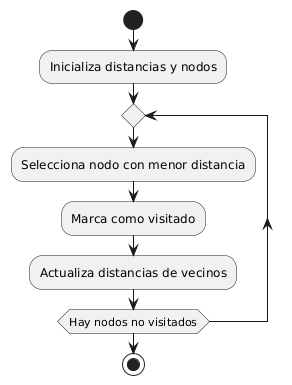
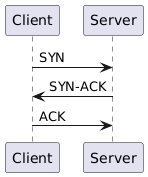
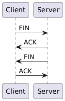

# Simulacro2

Link del repositorio: https://github.com/PaxuitoGIT/Simulacro2

---

## **Parte I: Capa de Red**

### **Pregunta 1: Cálculo de Ruta Más Corta**

#### a) Algoritmo de Dijkstra

El **Algoritmo de Dijkstra** encuentra la ruta más corta entre dos nodos en un grafo ponderado (con pesos positivos) siguiendo estos pasos principales:

1. Inicializa la distancia a todos los nodos como infinita, excepto el nodo origen, que se marca con distancia cero.
2. Marca todos los nodos como no visitados y crea un conjunto de nodos no visitados.
3. Selecciona el nodo no visitado con la distancia más corta, lo marca como visitado y actualiza las distancias a sus vecinos.
4. Para cada vecino, si la suma de la distancia desde el origen hasta el nodo actual y el peso de la arista es menor que la distancia conocida, actualiza la distancia.
5. Repite los pasos 3 y 4 hasta haber visitado todos los nodos o llegado al destino.

---

#### b) Enrutamiento por Inundación (Flooding)

**Definición:**  
El enrutamiento por inundación consiste en que cada nodo, al recibir un paquete, lo reenvía a todos sus enlaces excepto por el cual fue recibido.

- **Ventajas:**
  - Sencillez de implementación.
  - Alta fiabilidad, ya que todos los caminos posibles son explorados.

- **Desventajas:**
  - Consumo excesivo de ancho de banda (muchos paquetes duplicados).
  - No escala bien en redes grandes.

**Comparación con Dijkstra:**
- Dijkstra optimiza el camino y reduce el tráfico; Flooding no optimiza y puede generar congestión.
- Flooding es útil para descubrimiento de redes; Dijkstra para enrutamiento eficiente.

---

### **Pregunta 2: Direcciones de Broadcast y Subredes**

#### a) Subred 172.29.152.0 / 255.255.248.0

- **Máscara en binario:**  
  255.255.248.0 = 11111111.11111111.11111000.00000000
- **Red:**  
  172.29.152.0 = 10101100.00011101.10011000.00000000

Para obtener el broadcast, colocamos todos los bits de host a 1:
- Bits de host: los últimos 11 bits (porque 248=11111000 → 5 bits de subred, 3 bits de host en el tercer octeto + 8 bits del último octeto)
- Broadcast:
  - 172.29.(152 | 7).255 → 152+7=159
  - 172.29.159.255

**Proceso:**
- Identificamos los bits de host (0s en máscara).
- Ponemos esos bits en 1 en la dirección de red.
- Convertimos a decimal.

**Respuesta:**  
**Dirección de broadcast:** 172.29.159.255

---

#### b) Bloque 172.18.26.0/23

- /23 → 255.255.254.0 → 11111111.11111111.11111110.00000000
- Red: 172.18.26.0 = 10101100.00010010.00011010.00000000

- Bits de host: 9 bits (8 del último octeto + 1 del tercer octeto)
- Broadcast: poner esos 9 bits en 1:
  - El tercer octeto: 26 (00011010) | 1 = 27 (00011011)
  - El último octeto: 255

**Dirección de broadcast:** 172.18.27.255

---

### **Pregunta 3: Última Dirección Válida y Rango de Hosts**

#### a) Subred 172.30.67.192 / 255.255.255.192

- 255.255.255.192 = /26 (64 hosts por subred)
- Rango de subred: 172.30.67.192 a 172.30.67.255
- Broadcast: 172.30.67.255
- **Última dirección válida:** 172.30.67.254

---

#### b) Host 172.22.53.199 / 255.255.252.0

- 255.255.252.0 = /22 (1024 hosts por subred)
- Rango:
  - Tercer octeto: 53 (52-55, cada bloque de 4)
  - Red: 172.22.52.0
  - Broadcast: 172.22.55.255

**Rango de hosts válidos:**  
Primera: 172.22.52.1  
Última: 172.22.55.254

---

### **Pregunta 4: Capacidad y Segmentación de Subredes**

#### a) Número de hosts en 172.26.0.0 / 255.255.255.192

- /26 = 64 direcciones por subred.
- Hosts válidos = 64 - 2 = **62 hosts**.

---

#### b) Host 172.18.171.190 /23

- /23 = 255.255.254.0
- Tercer octeto: 171 → bloque de 2 (170-171)
- Red: 172.18.170.0
- Broadcast: 172.18.171.255

**Pertenece a la subred:** 172.18.170.0/23

---

### **Pregunta 5: Número de Subredes Necesarias**

- Fórmula: Nº de subredes = \(2^s\), donde s = bits prestados.
- Si se requieren al menos 4 subredes:  
  \(2^s \geq 4 \Rightarrow s = 2\)

**Ejemplo:**  
Si partimos de /24 y pedimos 2 bits, obtenemos /26 → 4 subredes.

---

## **Parte II: Capa de Transporte**

### **Pregunta 6: Comparación entre TCP y UDP**

#### a) Comparación

| Característica              | TCP                              | UDP                          |
|-----------------------------|----------------------------------|------------------------------|
| Establecimiento de conexión | Requiere (orientado a conexión)  | No requiere                  |
| Fiabilidad                  | Fiable, retransmite, ordena      | No fiable, sin reenvío       |
| Control de flujo/congestión | Sí                               | No                           |
| Velocidad                   | Más lenta (por control)          | Más rápida                   |

#### b) Ejemplos de aplicaciones UDP

- **Streaming de video/audio en tiempo real** (menos retraso, tolera pérdidas)
- **DNS** (respuestas rápidas, pequeñas y tolerantes a pérdidas)

---

### **Pregunta 7: Establecimiento y Terminación de Conexión en TCP**

#### a) Establecimiento (Three-Way Handshake):

1. **SYN**: Cliente → Servidor (solicita conexión)
2. **SYN-ACK**: Servidor → Cliente (acepta y responde)
3. **ACK**: Cliente → Servidor (confirma)

#### b) Terminación (Four-Way Handshake):

1. **FIN**: Cliente o servidor inicia cierre
2. **ACK**: Receptor confirma FIN
3. **FIN**: El otro extremo envía su propio FIN
4. **ACK**: Se confirma el segundo FIN

**Diagrama PlantUML: Handshake TCP**

---

### **Pregunta 8: Multiplexación y Demultiplexación**

- **Multiplexación descendente:** Múltiples aplicaciones usan el mismo canal (puertos → un solo canal de red).
  - *Ejemplo:* Varios programas usando la misma tarjeta de red.
- **Demultiplexación ascendente:** El sistema recibe datos y los redirige a la aplicación correcta según el puerto.
  - *Ejemplo:* Un servidor web y de correo en el mismo servidor.

---

### **Pregunta 9: Tamaño de Ventana en TCP**

**Datos:**
- RTT = 50 ms = 0.05 s
- BW = 100 Mbps = 100,000,000 bps
- MSS = 1,500 bytes = 12,000 bits

**Cálculos:**
1. **Ventana óptima (en bits):**  
   Ventana = $BW \times RTT = 100,000,000 \times 0.05 = 5,000,000$ bits
2. **En bytes:**  
   \(5,000,000 / 8 = 625,000\) bytes
3. **Nº de MSS:**  
   \(625,000 / 1,500 = 416.67\) segmentos MSS

---

### **Pregunta 10: Control de Congestión en TCP**

- **Slow Start:** Aumenta la ventana exponencialmente al inicio para descubrir la capacidad de la red rápidamente.
- **Algoritmo de Nagle:** Agrupa pequeños mensajes para reducir el número de segmentos pequeños y la congestión.
- **Algoritmo de Clark:** Evita que el receptor reciba múltiples pequeños segmentos, pidiendo al emisor que espere a que tenga espacio suficiente.

---

## **Parte III: Capa de Aplicación y Multimedia**

### **Pregunta 11: Funcionamiento de DNS**

1. El usuario ingresa un dominio en el navegador.
2. El sistema revisa su caché local.
3. Si no lo encuentra, consulta al **resolver DNS** configurado.
4. El resolver pregunta a los servidores raíz (root).
5. Los root responden con la dirección de los servidores TLD (.com, .net, etc.).
6. El resolver pregunta al TLD correspondiente.
7. El TLD responde con la dirección del servidor autoritativo del dominio.
8. El resolver pregunta al autoritativo, obtiene la IP y la devuelve al usuario.

---

### **Pregunta 12: Protocolos de Correo Electrónico**

| Protocolo | Función principal | Uso/acceso           | Almacenamiento         | Ejemplo adecuado                      |
|-----------|------------------|----------------------|------------------------|---------------------------------------|
| POP3      | Descargar mails  | Solo descarga        | Local, borra del server| Acceso offline, conexión intermitente |
| IMAP      | Gestionar mails  | Sincroniza servidor  | Servidor y local       | Acceso desde múltiples dispositivos   |
| SMTP      | Envío de mails   | Solo envío           | No almacena            | Envío de correos                      |

---

### **Pregunta 13: HTTP y FTP**

#### a) HTTP

- Protocolo de transferencia de hipertexto.
- Métodos: **GET** (obtener), **POST** (enviar datos), **PUT** (actualizar), **DELETE** (eliminar).
- Basado en solicitudes y respuestas.

#### b) FTP

- Protocolo para transferencia de archivos.
- Usa dos conexiones: una de control y una de datos.
- Diferencias: FTP mantiene la sesión y separa control/datos, HTTP es stateless.

---

### **Pregunta 14: Streaming y VoIP**

#### a) Tipos de streaming

| Tipo                    | Características                           | Ejemplo aplicación  |
|-------------------------|-------------------------------------------|---------------------|
| UDP streaming           | Baja latencia, no fiable                  | IPTV                |
| HTTP streaming          | Usa HTTP, más compatible, más latencia    | YouTube             |
| Adaptive HTTP Streaming | Ajusta calidad según ancho de banda       | Netflix (DASH)      |

#### b) Funcionamiento de VoIP

- Convierte voz en paquetes IP.
- Problemas: retardo, pérdida de paquetes, eco.
  - Soluciones: QoS, buffering, algoritmos de corrección de errores.

---

### **Pregunta 15: Control de Congestión en Multimedia**

- **Buffering en el cliente:** Previene cortes almacenando datos antes de reproducir.
- **Marcado de paquetes (DiffServ):** Prioriza paquetes multimedia en la red.

---

### **Pregunta 16: Best-Effort vs Servicios Multiclase**

| Modelo         | Tráfico                   | Garantía de QoS | Ejemplo aplicación   |
|----------------|---------------------------|-----------------|---------------------|
| Best-Effort    | Sin prioridad             | No              | Web, email          |
| Multiclase     | Priorización/clasificación| Sí, parcial     | Video, VoIP, gaming |

---

## **Parte IV: Seguridad en Redes**

### **Pregunta 17: Problemas de Seguridad**

| Área             | Definición                                         | Solución           |
|------------------|----------------------------------------------------|--------------------|
| Confidencialidad | Proteger datos de accesos no autorizados           | Cifrado            |
| Autenticación    | Verificar identidad de usuarios/dispositivos       | Multifactor, claves|
| No repudio       | Evitar que alguien niegue acciones realizadas      | Firmas digitales   |
| Integridad       | Garantiza que los datos no sean alterados          | Hash, HMAC         |

---

### **Pregunta 18: Cifrado Simétrico vs Asimétrico**

| Característica    | Simétrico      | Asimétrico         |
|-------------------|----------------|--------------------|
| Nº de claves      | Una (secreta)  | Dos (pública/privada) |
| Velocidad         | Rápido         | Lento              |
| Ejemplo algoritmo | AES, DES       | RSA, ECC           |
| Aplicaciones      | VPN, discos    | SSL/TLS, firmas    |

---

### **Pregunta 19: Algoritmo RSA**

#### a) Generación de claves

1. Elige dos primos: p, q.
2. Calcula n = p * q, φ(n) = (p-1)*(q-1).
3. Elige e tal que 1 < e < φ(n) y sea coprimo con φ(n).
4. Calcula d, inverso modular de e respecto a φ(n).

#### b) Ejemplo numérico

- p=3, q=11 ⇒ n=33, φ(n)=20
- e=7, d=3 (ya que 7×3 = 21 ≡ 1 mod 20)
- Mensaje M=4
- **Cifrado:** C = M^e mod n = 4^7 mod 33 = 16384 mod 33 = 16
- **Descifrado:** M = C^d mod n = 16^3 mod 33 = 4096 mod 33 = 4

---

### **Pregunta 20: Firewalls, VPN e IPSec**

#### a) Firewall

- **Filtrado de paquetes:** Analiza cabeceras y permite/bloquea según reglas.
- **Firewall de estado:** Monitorea estado de conexiones activas.

**Importancia:**  
Evita accesos no autorizados y ataques a la red.

#### b) VPN vs IPSec

| Característica | VPN                                 | IPSec                         |
|----------------|-------------------------------------|-------------------------------|
| Propósito      | Acceso remoto seguro                | Cifrado de tráfico IP         |
| Modo operación | Túnel, sobre Internet               | Transporte o túnel            |
| Ejemplo        | Acceso a red corporativa            | Cifrado entre routers         |

---

### **Pregunta 21: SSL/TLS y DNS Spoofing**

#### a) SSL/TLS

- Protocolos criptográficos que aseguran comunicaciones (HTTPS).
- Proveen cifrado, autenticación de servidor y de integridad.

#### b) DNS Spoofing y DNSSEC

- **DNS Spoofing:** Suplantación de respuestas DNS para redirigir tráfico.
- **DNSSEC:** Añade firmas digitales a respuestas DNS, garantizando integridad y autenticidad.

---